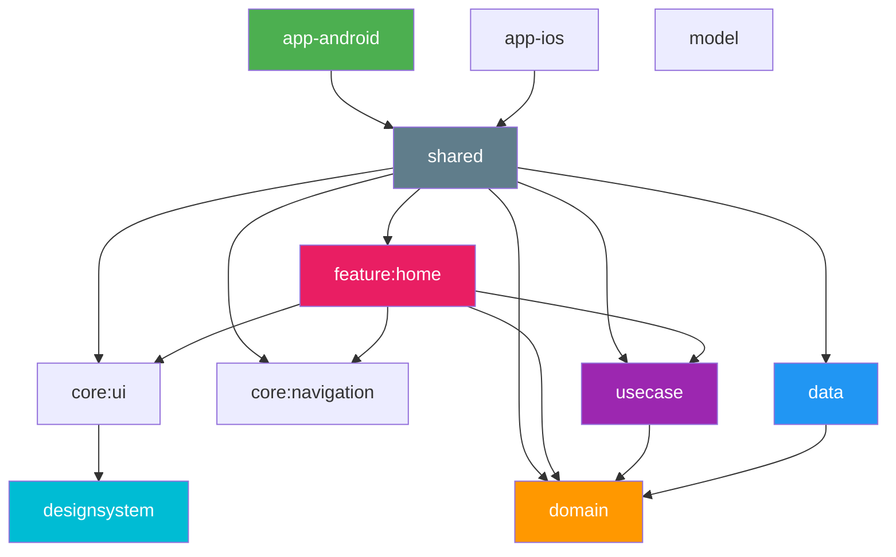

# Wishline

A mobile app for Android and iOS built with Kotlin Multiplatform and Compose Multiplatform.

Generated from [app-skeleton-cmp](https://github.com/rmakiyama/app-skeleton-cmp).

## Requirements

- Java 21 (Temurin). The version is pinned in `mise.toml`; run `mise install` to set it up
- Android SDK. Point Gradle to it via `ANDROID_HOME` or `local.properties`:
  ```properties
  sdk.dir=/path/to/Android/sdk
  ```
- Xcode (iOS only)

## Build & Run

### Android

```bash
./gradlew assembleDebug
```

Or open the project in Android Studio and run the `app-android` configuration.

### iOS

Open `app-ios/app-ios.xcodeproj` in Xcode and run the `app-ios` scheme.
The build phase compiles the shared framework via Gradle, so Java 21 must be
resolvable from the environment Xcode runs in.

From the command line:

```bash
xcodebuild -project app-ios/app-ios.xcodeproj -scheme app-ios \
  -configuration Debug -destination 'platform=iOS Simulator,name=iPhone 17' build
```

### Tests

```bash
./gradlew testDebugUnitTest testAndroidHostTest
```

CI runs with `warningsAsErrors=true`. Reproduce locally with `-PwarningsAsErrors=true`.

## Architecture

Clean Architecture with a multi-module structure. The UI is shared across
Android and iOS with Compose Multiplatform: `shared` hosts the app-level
Compose entry points (`App`, NavGraph, DI) and exposes the iOS framework.



See [AGENTS.md](AGENTS.md) for conventions and how to add a feature module.

## Tech Stacks

- UI (shared across Android / iOS)
    - Compose Multiplatform
    - Material 3
    - Navigation3
    - Edge-to-Edge
- Android
    - Jetpack Compose host (`app-android`)
- iOS
    - SwiftUI host with `ComposeUIViewController` (`app-ios`)
    - Shared framework (static)
- Kotlin Multiplatform
    - Metro (compile-time DI)
    - Coroutines
    - SQLDelight
    - Kermit
- Testing
    - Mokkery
    - Turbine
    - Kotest
- Development
    - Convention Plugins (`build-logic/`)
    - Gradle Version Catalog
