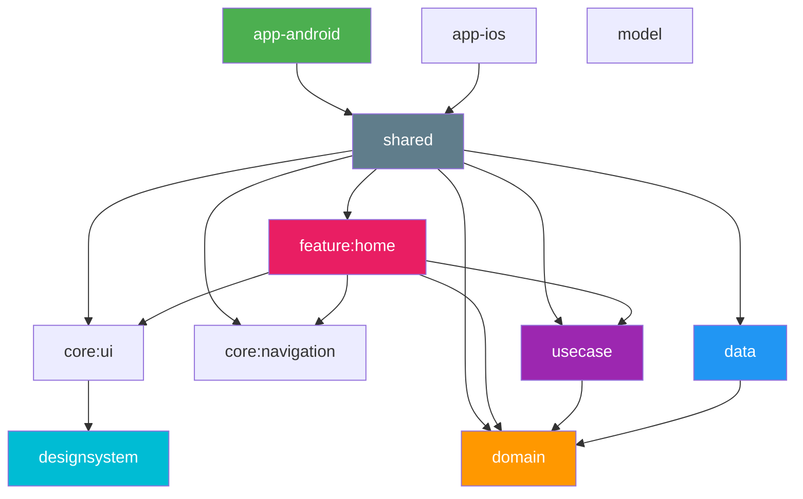

# App Skeleton CMP

A template repository for mobile apps built with Kotlin Multiplatform and Compose Multiplatform.

For a variant that keeps the UI native on each platform (Jetpack Compose on Android, SwiftUI on
iOS), see [app-skeleton](https://github.com/rmakiyama/app-skeleton).

## Setup

1. Use this template to create a new repository
2. Clone the new repository
3. Run the setup script:
   ```bash
   ./setup.sh --app-name "YourApp" --package "com.example.yourapp"
   ```
4. Open in Android Studio and sync Gradle
5. Run `app-android` configuration (Android) or open `app-ios/app-ios.xcodeproj` in Xcode (iOS)

## Architecture

Clean Architecture with a multi-module structure. The UI is shared across
Android and iOS with Compose Multiplatform: `shared` hosts the app-level
Compose entry points (`App`, NavGraph, DI) and exposes the iOS framework.



## Tech Stacks

- UI (shared across Android / iOS)
    - Compose Multiplatform
    - Material 3
    - Navigation3
    - Edge-to-Edge
- Android
    - Jetpack Compose host (`app-android`)
- iOS
    - SwiftUI host with `ComposeUIViewController` (`app-ios`)
    - Shared framework (static)
- Kotlin Multiplatform
    - Metro (compile-time DI)
    - Coroutines
    - SQLDelight
    - Kermit
- Testing
    - Mokkery
    - Turbine
    - Kotest
- Development
    - Convention Plugins (`build-logic/`)
    - Gradle Version Catalog
