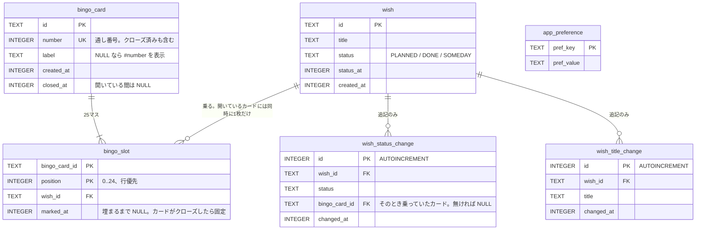

# db

**`.sq` を変えたら、同じコミットでこの図を更新する。**

```mermaid
erDiagram
    wish ||--o{ bingo_slot : "乗る。開いているカードには同時に1枚だけ"
    bingo_card ||--|{ bingo_slot : "25マス"
    wish ||--o{ wish_status_change : "追記のみ"
    wish ||--o{ wish_title_change : "追記のみ"

    wish {
        TEXT id PK
        TEXT title
        TEXT status "PLANNED / DONE / SOMEDAY"
        INTEGER status_at
        INTEGER created_at
    }
    bingo_card {
        TEXT id PK
        INTEGER number UK "通し番号。クローズ済みも含む"
        TEXT label "NULL なら #number を表示"
        INTEGER created_at
        INTEGER closed_at "開いている間は NULL"
    }
    bingo_slot {
        TEXT bingo_card_id PK
        INTEGER position PK "0..24、行優先"
        TEXT wish_id FK
        INTEGER marked_at "埋まるまで NULL。カードがクローズしたら固定"
    }
    wish_status_change {
        INTEGER id PK "AUTOINCREMENT"
        TEXT wish_id FK
        TEXT status
        TEXT bingo_card_id FK "そのとき乗っていたカード。無ければ NULL"
        INTEGER changed_at
    }
    wish_title_change {
        INTEGER id PK "AUTOINCREMENT"
        TEXT wish_id FK
        TEXT title
        INTEGER changed_at
    }
    app_preference {
        TEXT pref_key PK
        TEXT pref_value
    }
```

- テーブル間の関係は外部キーとして宣言していない。図の `FK` はクエリと Kotlin だけが守っている
- 時刻はすべてエポックミリ秒
- `app_preference` はオンボーディング完了などのフラグを持つ KV テーブルで、ビンゴのモデルとは無関係
