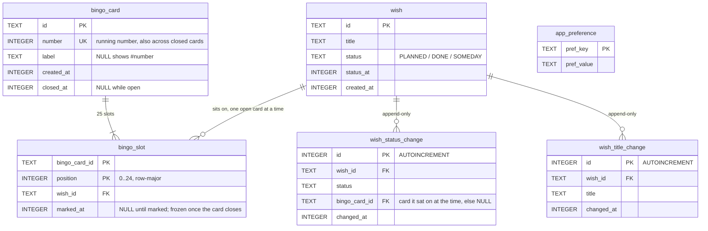

# db

**When you change a `.sq` file, update this diagram in the same commit.**

- Every foreign key is `ON DELETE RESTRICT`. SQLite enforces them only when the connection asks, so each `DatabaseDriverFactory` and the test driver turn them on
- Timestamps are epoch milliseconds
- `app_preference` is a key-value table for flags such as onboarding completion; it is unrelated to the bingo model
